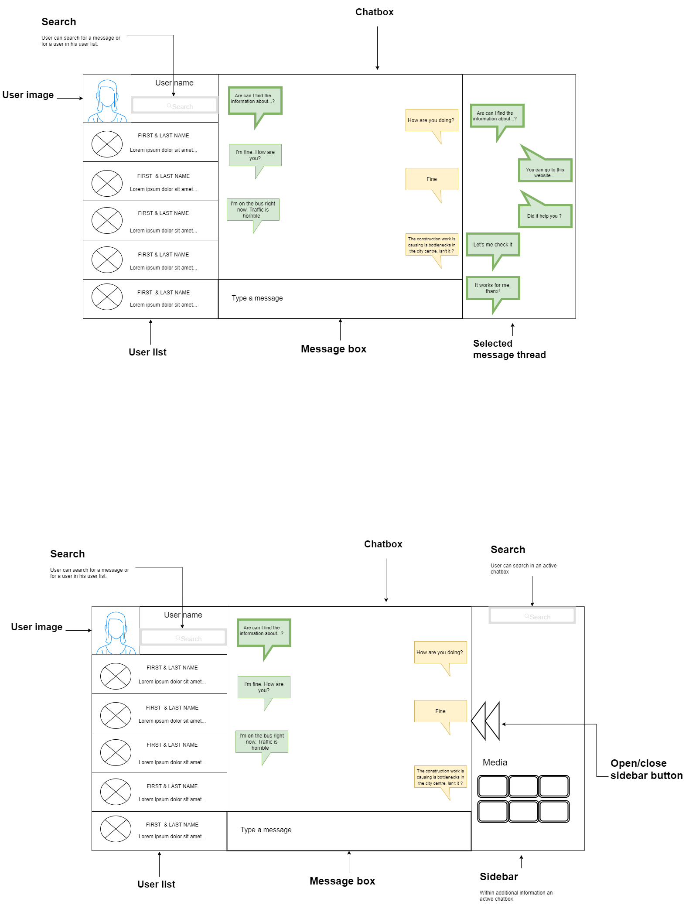

# chat4people

## TODO: Add TOC (Table of Content)

## Goal

The goal of the application is to make a chat where people can write to each other.

### Purpose

A custom application to chat with people.

### Change log

  ## Version alpha (current):
    - Write a message and create a conversation between two users
      - When a user sends a message to another user, the message does not appear immediately. Page has to be refreshed.
    - Display a contact list 
    - Search for a contact

  ## Version beta: 
    - Enable to delete or edit a message from the chat box
    - Enable to send a pictures via chat box
    - Add a tread for a chosen message
    - Search for a message by a term

### How to run
Clone the repository on your computer

```
git clone https://github.com/1n3ffbl3/chat4people.git
```

Ensure that you have either npm or yarn installed.
Go to frontend directory and run 'yarn' to install dependencies and 'yarn start' to start the application.

```
yarn
yarn start
```
Go to backend directory and run 'sails lift'.
Ensure that you have sails installed globally, if not use it from node_modules.

```
sails lift
```

Run 'docker-compose up'. Docker compose starts two docker containers. One of them is PostgreSQL database, second is a dashboard panel for PostgreSQL (PgAdmin v4).
```
docker-compose up
```
Check docker-compose.yml file for email and password then go to localhost:5005 in your browser and login.
```
localhost:5005
```


### Technologies / Tech stack

- React.js
- Redux
- Sails.js
- Knex.js
- PostgresDb
- Docker

### UI Designs

