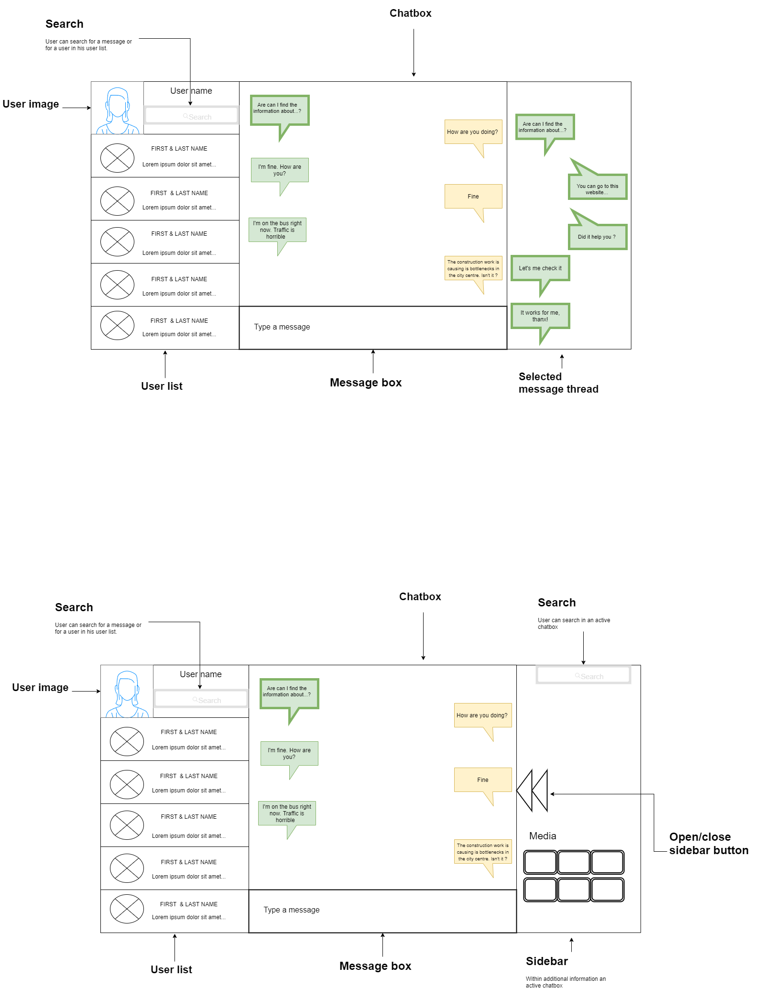

# Requirements brainstorming session

Date: 01/05/2020

Defining the initial concept for the application.

Application actors:
- User - person who uses the system
- Administrator - concept not defined yet

Actor functionalities:
- User:
    - Sending Message
        - User can send message to another user
        - User can send message to multiple users within a predefined group of users
    - Receiving message
        - User can see notification about received message
        - User can reply to the selected message in the thread
    - Message
        - User can mark read message as unread
        - User can edit message content
        - User can delete his/her message (for himself/ herself/ everyone in the chat)
        - User can't delete other message than his/her own
        
UI draft: 
        